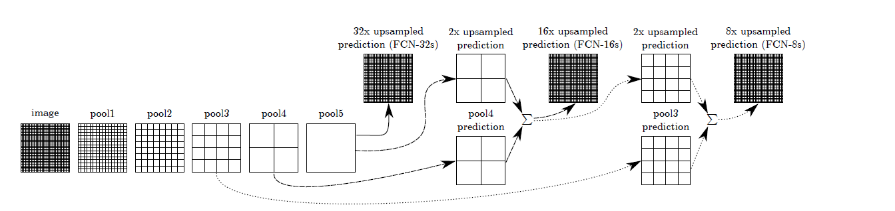

# Fully Convolution Network for Semantic Segmentation implentation in Tensorflow Keras.  

This repository is work in progress. This repository contains Tensorflow keras implementation of a slightly modified FCN for semantic segmentation as decribed in https://arxiv.org/abs/1411.4038 by Jonathan Long, Evan Shelhamer, Trevor Darrell. Below is the network architector introduced in the paper.  
  
The paper introduced a fully convolution network by replacing fully connected layers in classfication network with convolution layers to handle input image of arbitrary size. Skipped connections were used to combine semantic information from a deep, coarse layer with appearance information from a shallow, fine layer to produce accurate and detailed segmentations. There are 3 flavours -   
FCN-32s which upsamples predictions by a factor of 32 to original image size in single step.    
FCN-16s which upsamples the predictions by factor of 2, adds pool4 predictions and then upsamples by a factor of 16 to original image size.   
FCN-8s which upsamples the combined predictions in previos step by factor of 2, adds pool3 predictions and then upsamples by a factor of 8.   